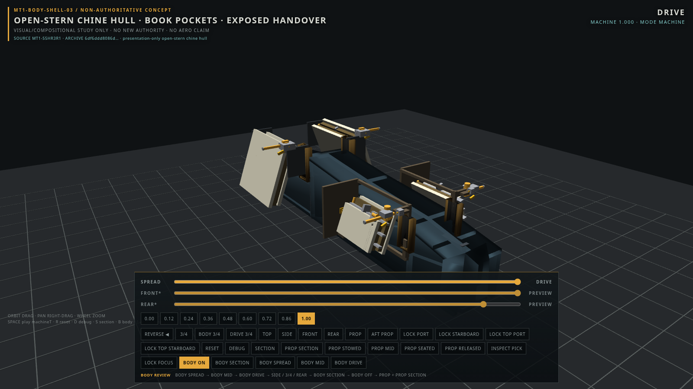

# Quarto

**A transforming machine you can take apart with your eyes.**

Quarto is an interactive Babylon.js exploration of a vehicle transformation: four articulated lateral assemblies fold, turn, and settle into their receiving shoulders while the stern mechanism completes a visible capture-and-lock sequence. The aim is to make the motion satisfying—and let you look closely enough to understand it.



The four assemblies are called **folios** (legacy/source: books). The smaller front pair sits low; the larger rear pair folds into the higher, canted **haunch** that gives Quarto its silhouette. The body frames the mechanism, with the roots, central carrier, and stern deliberately exposed.

## Explore it

From a checkout of this repository, with Node.js **20.19+**:

```bash
npm --prefix explore/body-shell-03 ci
npm --prefix explore/body-shell-03 run dev
```

Open **http://127.0.0.1:5185/** for the presentation viewer.

- **Drag, right-drag, and scroll** to orbit, pan, and zoom.
- Move the **machine slider** between **SPREAD** and **DRIVE**, or press **Space** to play/pause.
- Toggle **BODY ON / BODY OFF** to compare the presentation shell with the exposed mechanism.
- Use the **section controls**, camera presets, and **INSPECT PICK** to look inside and identify parts.

SPREAD and DRIVE are two required configurations of the same machine. The folios move from a roughly **13.32 m** spread to a **4.60 m** packed width; they fold and nest rather than shrinking or disappearing. At the open stern, a hollow thrust can moves around a fixed core into its receiver and locks. That handover is inspectable in both directions.

The first pose change can pause while the existing certification path runs. This is a known inspection cost.

## Where the project stands

The accepted `main` presentation is **BODY-SHELL-03.1 with FO1 receiving-shoulder refinements**. The body-architecture decision is an **exposed-carrier vehicle**: visible hardware and open spaces are part of the design.

The newer **solid-body surface repair, Hush Basin palette, and responsive viewer** are collected in **[PR #5: reconciled Quarto viewer](https://github.com/CharlesMish/quarto/pull/5)**. As checked on September 8, 2026, that PR is still open. Its [handoff and validation](https://github.com/CharlesMish/quarto/blob/feature/quarto-reconciled-viewer/docs/QUARTO_RECONCILIATION_01.md) cover the repaired surfaces, tour, Fit controls, and preserved FO1 geometry. To try that version, check out `feature/quarto-reconciled-viewer` and use the same commands above.

There is no new architecture slice scheduled. The next useful input is a concrete need from gameplay or inspection; the service-route study **SR1 remains parked**. The unsuccessful stern presentation study **SO1 remains a recorded negative result**.

For exact decisions, open questions, and engineering status, see **[Current state](docs/CURRENT_STATE.md)**.

## Quarto and Hush Basin

[**Hush Basin**](https://github.com/CharlesMish/hush-basin) is the Godot gameplay realization and semantic reference. Quarto explores the transformation in mechanical detail; Hush Basin gives those ideas a playable setting. They inform one another through motion, shape, and readability, with a simplified native vehicle rig on the Godot side rather than a literal 1:1 geometry export.

The [pause-and-return notes](https://github.com/CharlesMish/quarto/blob/feature/quarto-reconciled-viewer/docs/QUARTO_PAUSE_AND_RETURN.md) preserve possible future directions. Letting the gameplay version develop is a useful next step before adding more detail here.

## For developers and reviewers

**Quarto** is the machine name; **MT1** is the engineering-development lineage. The frozen mechanism remains **MT1-S5HR3R1**. BODY ON is presentation only; BODY OFF exposes the frozen mechanism. Presentation refinements do not create physical structure, reserved space, or authority rights.

The detailed [current-state record](docs/CURRENT_STATE.md) preserves the pending director dispositions. No cockpit, ground-contact hardware, utility profession, complete engine, or propulsion-performance claim is assigned.

| Start here | What it contains |
| --- | --- |
| [Presentation package](explore/body-shell-03/) | Babylon viewer, body-shell lineage, and presentation tests |
| [Current state](docs/CURRENT_STATE.md) | Accepted decisions, frozen status, and remaining unknowns |
| [Evidence index](explore/body-shell-03/evidence/README.md) | Recorded presentation studies and review images |
| [Nomenclature](docs/NOMENCLATURE.md) | Folio, haunch, chine, and preserved engineering identities |
| [Operator contract](AGENTS.md) | Branch workflow and frozen boundaries for contributors and agents |

For the separate engineering/authority viewer at **http://127.0.0.1:5181/**:

```bash
npm ci
npm run dev
```

Use the lightweight APIs to identify a running build without initiating an authority evaluation:

```js
window.__MT1.getBuildInfo()
window.__MT1.getInspectionState()
```

After installing root and presentation dependencies, the supported checks are:

```bash
npx playwright install chromium
npm run build
npm test
npm --prefix explore/body-shell-03 run build
npm --prefix explore/body-shell-03 test
```

Capture and authority/evidence writers are separate from these checks because they can regenerate recorded evidence. Historical reports and frozen identifiers retain their original names. Start changes on a task branch from accepted `main` and bring them back through a reviewable pull request.
