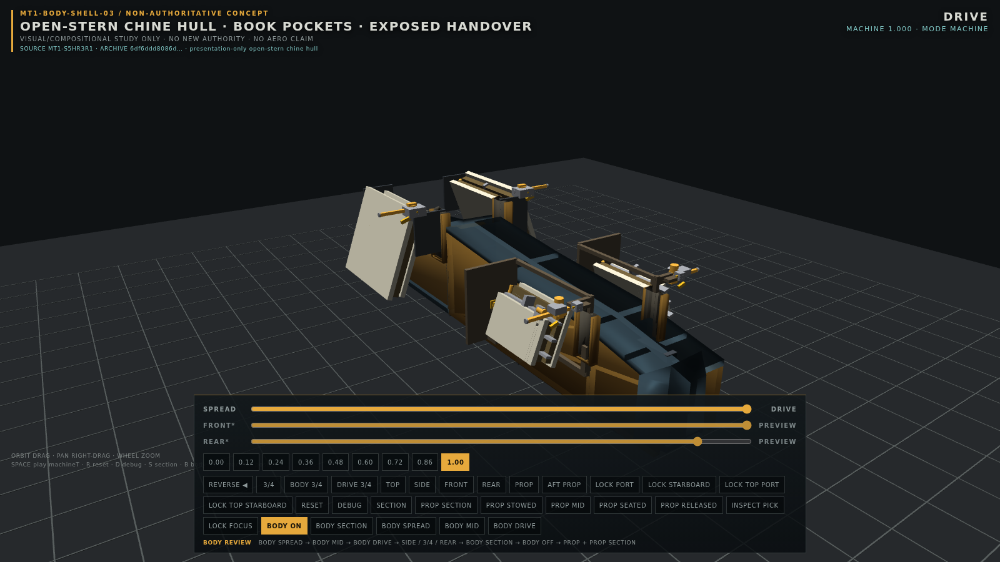

# Quarto

Quarto is a long, dual-envelope, open-stern machine built in Babylon.js so that transformation can be inspected rather than hidden. Four articulated folios (legacy/source: books) deploy outboard in SPREAD and return to proud sockets along the presentation shell's chine in DRIVE. The larger rear pair packs at a higher aft station, taking on the characteristic 70° haunch above the smaller forward pair. At the stern, a hollow thrust can translates around a fixed core into a visible receiver, capture, and lock handover.



**QUARTO is the whole machine.** **MT1 is its engineering-development lineage.** The current frozen mechanism identifier remains **MT1-S5HR3R1**; existing MT1 slice names, registration IDs, source identifiers, reports, evidence, and hashes retain their original identities.

Quarto does not yet claim a vehicle profession. Nothing here establishes flight, aircraft, ground-contact hardware, a cockpit, a complete engine, or propulsion performance.

## Current baseline

The `feature/quarto-body-surface-refinement` branch carries the
[Quarto viewer 01](docs/QUARTO_VIEWER_01.md) controls and palette comparison forward
with the **BODY-SHELL-03.2** solid-body surface candidate. See the
[body refinement handoff](docs/QUARTO_BODY_SURFACE_01.md) for repaired panels,
inspection behavior and validation. The accepted mechanism, BODY-SHELL-03.1
record and architecture dispositions below remain intact.

| Item | Current record |
| --- | --- |
| Human-facing machine name | **Quarto** |
| Internal engineering lineage | **MT1** |
| Frozen current mechanism | **MT1-S5HR3R1** |
| Authority record | `GREEN_PENDING_DIRECTOR`; `FREEZE_CANDIDATE_PENDING_DIRECTOR` |
| H1 presentation/director status | `AWAITING_DIRECTOR_DISPOSITION`; not self-passed |
| Accepted presentation shell | **BODY-SHELL-03.1**, non-authoritative |
| Accepted architecture-study chain | **VA1 → GE1 → US1 → KC1 → KS1** |
| Next planned slice | **MT1-SR1**, generic service-route reservation / architecture; not begun |

The concise handoff is [docs/CURRENT_STATE.md](docs/CURRENT_STATE.md). The mandatory vocabulary and operator contracts are [docs/NOMENCLATURE.md](docs/NOMENCLATURE.md) and [AGENTS.md](AGENTS.md).

## Vocabulary

| Term | Meaning here |
| --- | --- |
| **Quarto** | The complete machine and its human-facing project name. It does not replace frozen MT1 identifiers. |
| **Folio** | One complete articulated lateral assembly. Quarto has front/rear × port/starboard folios. Frozen source uses `book`/`BOOK`; those identities do not change. |
| **Haunch** | The canted, folded packing posture and shoulder relationship produced by the frozen ~70° geometry. It is not a part class or a new state. |
| **Chine** | The longitudinal faceted shoulder language of BODY-SHELL-03.1. It is presentation language, not the ventral keel and not authority. |
| **Handover** | The inspectable fixed-core / hollow-thrust-can / receiver-capture-lock sequence. It is not a complete engine or a performance claim. |
| **BODY OFF** | Frozen, inspectable mechanism and authority view. |
| **BODY ON** | The accepted BODY-SHELL-03.1 presentation view; it creates no structure, keepout, volume, or authority rights. |

See [docs/NOMENCLATURE.md](docs/NOMENCLATURE.md) for the canonical human vocabulary, including SPREAD, DRIVE, STRUCTURAL_READY, and historical wording.

## Two required configurations

SPREAD and DRIVE are both frozen required configurations of the same complete machine.

**SPREAD** places all four folios outboard at the full wide envelope. The certified endpoint width is approximately **13.320 m**.

**DRIVE** folds, restrains, yaws, cants, and nests the four folios against their receiving structure. In the accepted shell they dock proud of the chine rather than disappearing flush into it. The certified DRIVE width is approximately **4.600 m**, the same as STRUCTURAL_READY. The propulsion handover remains visible and inspectable through the open stern.

The historical **3.0–3.6 m** DRIVE-width sketch is superseded and is not a target.

## Mechanical tour

### 1. Forward folio pair

The forward port and starboard folios are the smaller pair at the lower, forward station. Each follows the proven sequence:

1. fold the outer member underside-to-underside;
2. establish folio restraint, then yaw aft and cant into the 70° family;
3. translate on the fixed socket rail, acquiring the separately supported passive catch near the end of the stroke;
4. seat and lock the separate +X nest pin in its four-piece receiver.

The lower station and shorter geometry were selected with the fold-floor history in view. The receiving carry remains an open framed cradle rather than a volume-filling block.

### 2. Rear folio pair

The rear pair is larger and occupies the higher, aft station. Its high shoulder is functional: it gives the larger outer member room to fold downward without crossing the floor datum. After fold and restraint, the package yaws aft, rolls into its 70° haunch, sockets inboard, and locks into the rear nest. In DRIVE the rear folios form the higher, more pronounced shoulder relationship above the forward pair.

### 3. Bilateral packing

Port and starboard mechanisms are both physical, registered participants. SPREAD and DRIVE are not separate machines or optional display poses; they are required endpoints connected by the frozen `machineT` choreography. The certified envelope contracts from about **13.320 m** wide in SPREAD to **4.600 m** at STRUCTURAL_READY and DRIVE without shrinking, hiding, or deleting folio material.

### 4. Propulsion handover

The centerline propulsion study is deliberately legible. A fixed core remains mounted into the keel/bay load path while a hollow, positive-thickness thrust can translates aft around it on fixed guides. Near the terminal station, the moving receiver approaches the fixed hollow spigot, establishes a continuous open passage, registers geometrically, locates on four seat tongues, and is retained by four captive cam-driven locks. The load path then passes through the handover frame to the aft structure and ventral keel.

The stern stays open so the can, receiver, capture, locks, and reverse release can be inspected. The can is not promoted into a complete engine, and the model makes no flow-rate, thrust, sealing, aero, or propulsion-performance claim.

### 5. Accepted BODY-SHELL-03.1

BODY-SHELL-03.1 is a long, faceted, open-stern hull with a rising chine and four presentation C-sockets grown along that chine. In SPREAD the sockets read as owned receiving locations; in DRIVE the folios dock visibly proud rather than being buried flush. The stern collar continues to frame, not conceal, the propulsion handover.

The shell is presentation only. Its 101-sample triangle–OBB fit reports zero defects, but it does not participate in authority and creates no volume rights. The accepted live exploration is [explore/body-shell-03](explore/body-shell-03/); its preserved predecessor is [explore/body-shell-03/baseline-03](explore/body-shell-03/baseline-03/).

### 6. Vehicle-architecture study chain

| Slice | Result |
| --- | --- |
| **VA1** | Establishes the dual-configuration obligation: SPREAD and DRIVE are both required configurations. VA1 is defined in the GE1 records rather than a standalone report. |
| **GE1** | Makes Quarto ground-aware through the existing floor/clearance facts and gameplay semantics, but selects no contact architecture. Wheels, skids, feet, hover, and suspension remain unassigned. |
| **US1** | Finds no empty longitudinal spine: only occupied structural carriers plus bulkhead and propulsion-bay interruptions. A route candidate may ride the ventral-keel faces and a truncated candidate lane on the dorsal-longeron underside; no space or volume right is granted. |
| **KC1** | Finds a coherent forward-to-aft carrier, but requires declared crossing treatment at three solid bulkheads. It authorizes no penetration or cut. |
| **KS1** | Closes those crossings with outcome **A — CROSSINGS_FEASIBLE_WITHOUT_STRUCTURE_CHANGE**. All three selected edge-bypass doglegs are `COMPLETE_DOGLEG_CLEAR`. |

KS1 screens complete C/dogleg bypasses clear at `BULKHEAD_Z3.35`, `BULKHEAD_Z1.15`, and `BULKHEAD_Z-1.70`. The Z−1.70 station also has a clear local offset surface handoff for the truncated dorsal lane. No hollow longitudinal spine exists; the ventral keel is the service-carrier candidate. No sleeve or bulkhead cut is required. The bounded sleeve candidates remain documented backup architecture hypotheses only.

The next intended slice is **MT1-SR1 — generic service-route reservation / architecture on the proven skeleton**. It has not started, and no utility profession is assigned.

## Hush Basin

**Hush Basin** is the current name of the Godot sister project: the gameplay realization and semantic reference. **Quarto** is the detailed Babylon.js mechanism and vehicle-architecture exploration.

They are not literal 1:1 geometry exports. Quarto may learn state and readability obligations from Hush Basin; Hush Basin inherits simplified mechanics and semantics from Quarto through the [native vehicle candidate](https://github.com/CharlesMish/hush-basin/tree/feature/quarto-native-vehicle-v1), delivered at commit `0b0cc10`. Its native Godot validation remains a separate task. Historical material that says “District Zero” remains archival evidence and is not rewritten.

## Run and inspect

Prerequisite: Node.js **20.19+**.

Install the root mechanism viewer and browser once:

```bash
npm ci
npx playwright install chromium
```

Run the frozen mechanism/authority view:

```bash
npm run dev
```

Vite serves it at `http://127.0.0.1:5181/`.

Run the accepted BODY-SHELL-03.1 presentation viewer:

```bash
npm --prefix explore/body-shell-03 ci
npm --prefix explore/body-shell-03 run dev
```

That viewer uses `http://127.0.0.1:5185/` and provides `BODY ON` / `BODY OFF`, body/propulsion section controls, the frozen machine poses, and the H1 inspection cameras.

## Controls

| Input | Action |
| --- | --- |
| Drag / right-drag / wheel | Orbit / pan / zoom |
| Machine slider | Canonical `machineT` |
| Front / rear sliders | Noncanonical `FRONT_PREVIEW` / `REAR_PREVIEW` inspection |
| `0.00` … `1.00` or `1`–`9` | Nine machine inspection poses |
| Space | Play / pause `machineT` (12-second endpoint travel) |
| `R` | Reset camera |
| `D` | Debug state, readiness, and local stages |
| `S` | Section view of bay, channel, drive corridor, and reservations |
| PROP / AFT PROP | Propulsion handover cameras |
| PROP STOWED / MID / SEATED / RELEASED | Canonical H1 review poses |
| LOCK PORT / STARBOARD / TOP PORT / TOP STARBOARD | Lock close-ups |
| LOCK FOCUS | Presentation-only visibility isolation |
| INSPECT PICK | Read-only mesh identity, authority role, registration ID, and purpose |

`INSPECT PICK` and the lightweight provenance APIs do not run authority, generate a certificate, sweep geometry, or mutate the pose.

```js
window.__MT1.getBuildInfo()
window.__MT1.getInspectionState()
```

Use those two calls to identify a running build. `window.__MT1.runS5Authority()` is a heavyweight authority evaluation, not a provenance query.

## Validation

The normal validation set that does not regenerate accepted evidence is:

```bash
npm run build
npm test
npm --prefix explore/body-shell-03 run build
npm --prefix explore/body-shell-03 test
```

The root build includes TypeScript checking. `npm test` runs the supported serial deterministic regression suite while excluding the explicit authority/evidence writers. Capture and writer scripts are intentionally separate because they can regenerate accepted evidence.

The explicit Babylon default-shader registrations in `src/scene/materials.ts` and the BODY-SHELL-03.1 copy are required build plumbing and must remain in place.

## Repository map

```text
src/design/                         frozen parameters and study dimensions
src/machine/                        keel, four folios (source: books), drive, maps, reservations
src/math/                           stage windows and OBB/SAT separation
src/verify/                         clearance, capture, and authority evaluation
src/study/                          informative architecture studies
src/scene/ and src/ui/              Babylon inspection scene and HUD
tests/                              Playwright gates and explicit evidence generators
evidence/                           accepted JSON, SVG, and review PNG evidence
explore/body-shell-01/              preserved shell exploration lineage
explore/body-shell-02/              preserved shell exploration lineage
explore/body-shell-03/              accepted BODY-SHELL-03.1 presentation package
explore/body-shell-03/baseline-03/  preserved BODY-SHELL-03 predecessor
docs/                               current-state and human nomenclature handoff
```

Start with these records:

- mechanism and H1: [MT1_S5HR3R1_AUTHORITY_REPORT.md](MT1_S5HR3R1_AUTHORITY_REPORT.md), [MT1_S5HR3R1_CLOSURE.md](MT1_S5HR3R1_CLOSURE.md), [MT1_S5HR3R1_H1_PRESENTATION_REPORT.md](MT1_S5HR3R1_H1_PRESENTATION_REPORT.md);
- accepted shell: [BODY_SHELL_03_COMPLETION.md](explore/body-shell-03/BODY_SHELL_03_COMPLETION.md), [BODY_SHELL_03_1_POCKET_CORRECTION.md](explore/body-shell-03/BODY_SHELL_03_1_POCKET_CORRECTION.md);
- architecture chain: [MT1_GE1_RESULTS.md](MT1_GE1_RESULTS.md), [MT1_US1_RESULTS.md](MT1_US1_RESULTS.md), [MT1_KC1_RESULTS.md](MT1_KC1_RESULTS.md), [MT1_KS1_RESULTS.md](MT1_KS1_RESULTS.md).

Historical reports are design evidence. Their MT1, `book`, Mechanical Truth, District Zero, filenames, hashes, and identifiers remain intact.

## Working contract

Read [AGENTS.md](AGENTS.md) before substantive work. `main` is the accepted baseline; experiments belong on task branches and should arrive through reviewable pull requests.

Do not begin S6, cockpit/intake architecture, engine-detail work, aero/CFD, propulsion-performance work, ground hardware, or utility-profession assignment unless a task explicitly reopens that scope.
