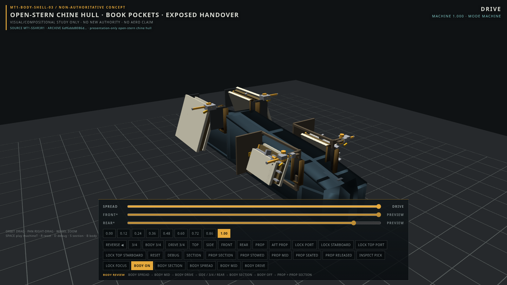

# Quarto

**A transforming machine you can take apart with your eyes.**

Quarto is an interactive Babylon.js study of one vehicle transformation. Four side assemblies fold, turn, and settle against the body, and a mechanism at the stern captures and locks. The aim is to make the motion satisfying and to let you look closely enough to understand it.

**[Open the public presentation →](https://quarto.cmish.dev/)**



The four side assemblies are called **folios**. The smaller front pair sits low. The larger rear pair folds into a higher, canted posture, the **haunch**, which gives Quarto its silhouette. The body frames the mechanism and leaves the roots, the central carrier, and the stern exposed on purpose.

## Explore it locally

From a checkout of this repository, with Node.js **20.19+**:

```bash
npm --prefix explore/body-shell-03 ci
npm --prefix explore/body-shell-03 run dev
```

Open **http://127.0.0.1:5185/** for the presentation viewer.

- **Drag, right-drag, and scroll** to orbit, pan, and zoom.
- Move the **machine slider** between **SPREAD** and **DRIVE**, or press **Space** to play/pause.
- Choose **Inspect**, **Show**, or **Game** for playback speed; the slider stays direct.
- Toggle **BODY ON / BODY OFF** to compare the presentation shell with the exposed mechanism.
- Use the **section controls**, camera presets, and **INSPECT PICK** to look inside and identify parts.

SPREAD and DRIVE are the machine's two required configurations, about **13.32 m** and **4.60 m** wide. The folios fold and nest; they don't shrink or disappear. At the open stern, a hollow thrust can moves around a fixed core into its receiver and locks. This sequence is the **handover**, and you can inspect it in both directions.

Dragging the slider and playing the transformation don't run the full geometry check. Opening diagnostics does: a notice appears, then the viewer pauses once while the check runs. Scripted evidence work still uses the checked path.

## Where the project stands

The current viewer combines the receiving shoulders from the FO1 study with a repaired solid body and the Hush Basin palette. Quarto is an **exposed-carrier vehicle**: visible hardware and open spaces are part of the design.

No new study is scheduled. The next change should answer a concrete need from gameplay or inspection. An unsuccessful stern study (SO1) is kept as a negative result, and a service-routing study (SR1) is parked. Possible future directions are in the [pause-and-return notes](docs/QUARTO_PAUSE_AND_RETURN.md).

For decisions and open questions, see **[Current state](docs/CURRENT_STATE.md)**. For the project's scope, see the **[charter](docs/CHARTER.md)**.

## Quarto and Hush Basin

[**Hush Basin**](https://github.com/CharlesMish/hush-basin) is a Godot game. Its vehicle was adapted from Quarto as a simplified rig, not a geometry export. Quarto explores the transformation in mechanical detail, and Hush Basin gives it a playable setting. The two inform each other through motion, shape, and readability. Findings from play are the most useful input for future changes here.

## For developers and reviewers

**Quarto** is the machine and project name. **MT1** is the prefix used by the engineering record and code. The mechanism, **MT1-S5HR3R1**, is settled; changing it needs a task that explicitly reopens it. BODY ON is presentation only, and BODY OFF shows the mechanism. The presentation body creates no structure or reserved space.

No cockpit, ground contact, job, complete engine, or propulsion performance is assigned.

| Start here | What it contains |
| --- | --- |
| [Presentation package](explore/body-shell-03/) | Babylon viewer, body-shell lineage, and presentation tests |
| [Current state](docs/CURRENT_STATE.md) | Accepted decisions and remaining unknowns |
| [Evidence index](explore/body-shell-03/evidence/README.md) | Recorded presentation studies and review images |
| [Nomenclature](docs/NOMENCLATURE.md) | Quarto's terms and the engineering names they map to |
| [Operator contract](AGENTS.md) | Branch workflow and fixed boundaries for contributors and agents |
| [Hosting](docs/HOSTING.md) | Public presentation deployment versus the separate authority viewer |
| [Charter](docs/CHARTER.md) | Purpose, scope, and voice |
| [Changelog](CHANGELOG.md) | Notable changes |

For the separate engineering/authority viewer at **http://127.0.0.1:5181/**:

```bash
npm ci
npm run dev
```

To identify a running build without running the geometry check, use:

```js
window.__MT1.getBuildInfo()
window.__MT1.getInspectionState()
```

After installing root and presentation dependencies, the supported checks are:

```bash
npx playwright install chromium
npm run build
npm test
npm --prefix explore/body-shell-03 run build
npm --prefix explore/body-shell-03 test
```

For the public Worker build:

```bash
npm run build:public
npx wrangler deploy
```

Capture and evidence-writer scripts are kept separate from these checks because they can regenerate recorded evidence. Historical reports and engineering identifiers keep their original names. Start changes on a task branch from `main`, and bring them back through a pull request for review.

## License

MIT. See [LICENSE](LICENSE).
