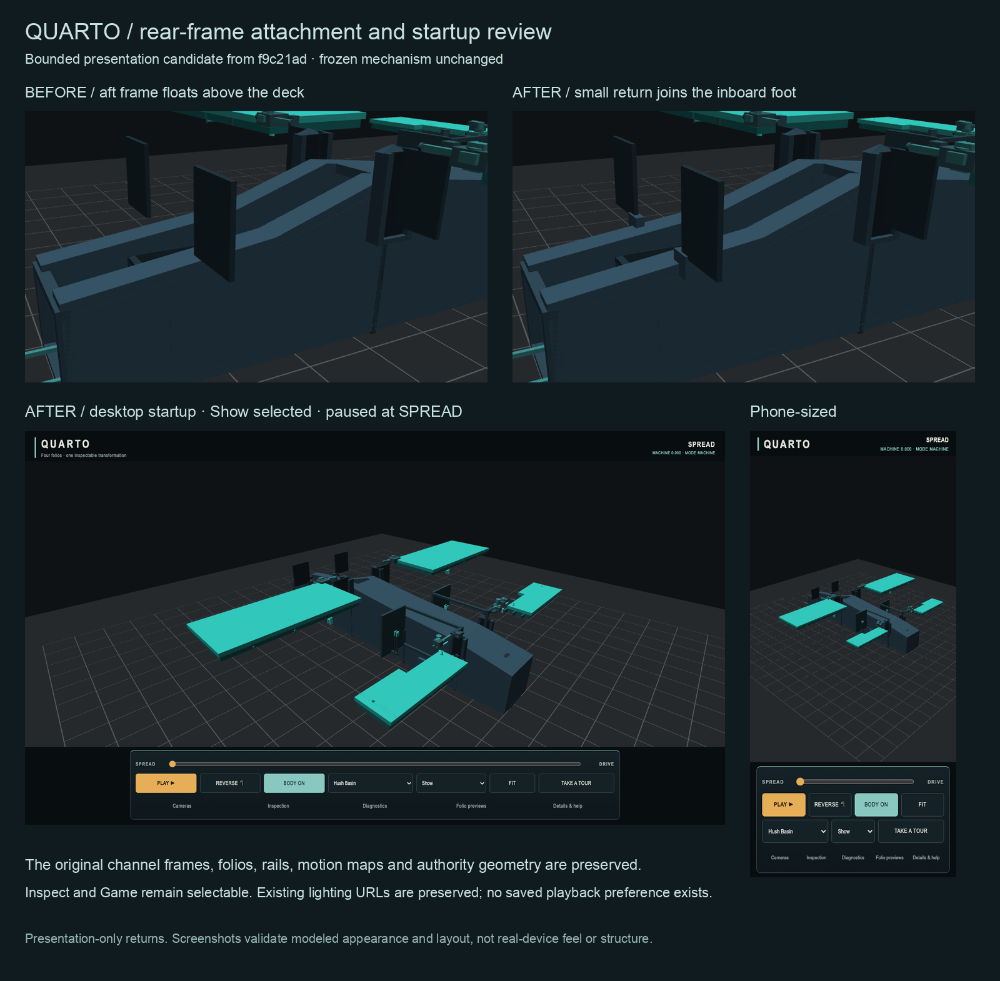

# Rear-frame attachment and Show startup review

Candidate based on accepted `main` at `f9c21adff3921f8e9bdea9266f51098c9c6f919d`.
Authority participation: **none**. No main merge or production deployment.

## Findings and bounded change

The owner's square-looking supports are `CHANNEL_FRAME_AFT` and
`CHANNEL_FRAME_STBD_AFT`, the frozen rear receiving-channel aft frames.
Each measures 0.80 × 0.98 × 0.06 m and starts at Y=1.72, Z=−4.48.
The local presentation deck ends near Y=1.63 there. The space below the
inboard foot made both frames appear detached.

Two small `BODY_REAR_FRAME_RETURN_*_VIS` meshes bridge that space at the
inboard feet. Each is 0.30 m wide and 0.12 m deep, ends at Y=1.76, and
overlaps the deck and frame instead of relying on near-touching surfaces.
They use the existing hull material, BODY toggle, starboard section behavior,
PROP SECTION ghosting, palette and lighting. They remain presentation-only,
physical=false, with no registration or structural claim.

All 38 prior BODY meshes retain their actual vertices, normals and indices.
The FO1 receiving stations retain their accepted geometry and material hierarchy.
Both original frames, all mechanism geometry, motion maps, bounds, parameters,
certificates, shared primitives and shaders are unchanged. The other front/rear
receiving details were inspected at SPREAD, an intermediate pose and DRIVE;
no additional small visual attachment repair was identified within this scope.
Open carrier and stern regions remain intentional.

Inspect, Show and Game are **playback speeds**, not different machine modes.
Show is now the default: about 3.93 seconds toward DRIVE, with readable phase
changes, compared with Inspect's slower study pacing and Game's 0.24-second
target. The initial pose stays paused at SPREAD. Inspect and Game remain in the
same select, and direct scrubbing is unchanged. The stale twelve-second help
text now explains the profiles.

Source inspection found no playback URL override or saved playback preference.
No persistence or new URL semantics were introduced. Explicit `?lighting=`
choices are preserved and covered by reload tests. A manual speed choice remains
active for the current visit; reload starts with Show, as the prior implementation
always reset to Inspect.

## Validation and evidence

- Authority and presentation TypeScript/production builds passed.
- Presentation suite: **49 passed**. Includes cold startup/reload, explicit
  lighting URLs, mid-playback speed transitions, all timing profiles, canonical
  versus interactive posing, BODY/palette/section behavior, and desktop/mobile
  controls and Fit framing.
- The 101-pose, 0.01-step triangle–OBB presentation fit passed with zero defects.
  This is sampled geometric screening, not a continuous or structural proof.
  The recorded pocket-gutter measurements are unchanged, including the existing
  rear AABB gutter of approximately −0.0014 m; no fit predicate was altered.
- Actual surface checks passed: 40 closed, outward, flat meshes; 20 mirrored
  pairs; the existing 72 seam observations; and positive triangle-based deck
  and frame contact intervals for both returns (0.14 m and 0.04 m respectively).
- First presentation run: 47 passed, one Game timing assertion failed. It
  treated the slowest observed frame as every frame (8 mixed-rate frames versus
  a 7-frame budget). The test now sums each observed interval with the viewer's
  existing 50 ms clamp. Product timing is unchanged. The raw first result is
  retained alongside the final result.
- Built-production smoke passed: Inspect, Show and Game each reached both
  endpoints at 1280×720 and 390×844, kept certification stale, and produced no
  page or console errors. No horizontal overflow was observed.
- Root authority regression suite: result to be recorded after the running
  check completes.

Matched `before/` and `after/` screenshots include the aft frames at machineT
0, 0.6 and 1, desktop startup/DRIVE, and 390×844 startup/DRIVE. `live/` records
the public page's lightweight build/inspection APIs and startup screenshot.
The live page still selects Inspect and identifies frozen MT1-S5HR3R1; that API
reports authority/archive provenance, not a deployed Git commit SHA.



The review image is also saved in Library as
`/quarto-rear-attachment-startup-review.png` (506,489 bytes):
`libfile_1bf16bd83a5c8191a50b2a051964d367`,
`file_00000000711881f59e8b227901d9be6e`.

Evidence capture is separate from the non-writing suite. To capture matched
views, use the appropriate baseline/candidate checkout and run:

```bash
ATTACHMENT_PHASE=before MT1_BASE_URL=http://127.0.0.1:5185 \
  npx playwright test tests/capture-attachment-review.spec.ts \
  --grep 'capture rear-frame' --output /tmp/quarto-attachment-capture --workers=1
```

Change `before` to `after` for the candidate. The production smoke uses
`--grep 'production playback'` and the production preview URL. Live provenance
uses `--grep 'live viewer'` without invoking certification. Never reuse the
normal test output directory for a concurrent evidence capture.

## Changed files, consulted records and limits

Changed: root `README.md`; presentation `src/bodyConceptInfo.ts`,
`src/scene/bodyShellConcept.ts`, `src/scene/createScene.ts`,
`src/ui/createUI.ts`, `tests/body-surface.spec.ts`, `tests/playback.spec.ts`,
`tools/verify-body-surface.mjs`; new `tests/capture-attachment-review.spec.ts`
and this evidence directory. `detailRevision: REAR-FRAME-01` distinguishes the
two added details without renaming surface, station or authority identity.

Consulted: `AGENTS.md`, README, `docs/CURRENT_STATE.md`, nomenclature, hosting,
the September presentation review, frozen builders/parameters and tests,
accepted BODY/FO1 records, existing fit evidence, and the live viewer.
There were no repository `.agents`/`.codex` instructions or local memory
summaries in this fresh isolated checkout. The separate open documentation
draft PR #9 was inspected and left untouched.

Screenshots and headless browser checks establish modeled appearance and
layout, not physical-phone feel, fabrication feasibility or structural integrity.
No new physical relationship or authority promotion is asserted. No frozen
authority evidence was regenerated or edited.
