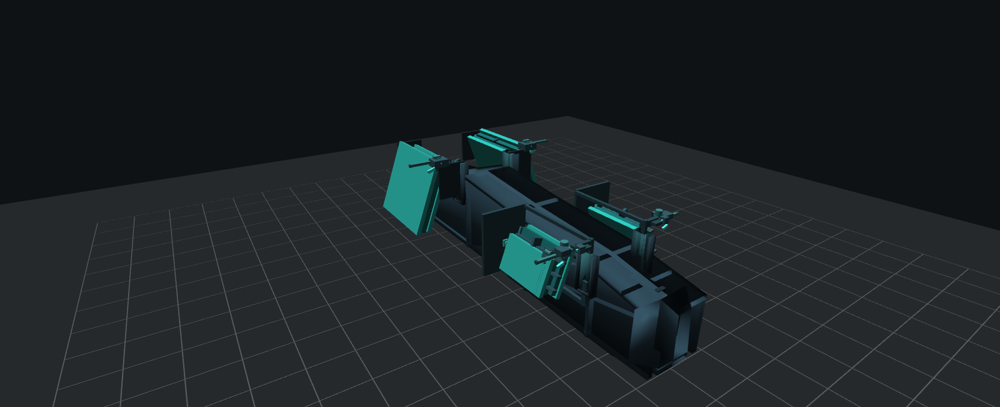
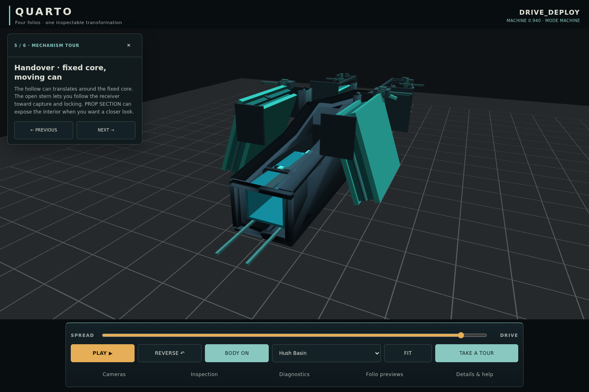

# Quarto viewer 01 — review evidence

This evidence belongs to the presentation candidate on
`feature/quarto-viewer-readability`, based on accepted `9321de4`.
See the [handoff](../../../../docs/QUARTO_VIEWER_01.md) for implementation,
validation and remaining limits. **Authority participation: none.**

## Matched palette views

Each pair holds geometry, pose, camera and lighting constant. The accepted
materials are restored by reference; render identity, visibility and lightweight
inspection state are compared at every switch.

| View | Accepted Quarto | Hush Basin inspired |
| --- | --- | --- |
| SPREAD | [Image](final-review/spread-accepted.png) | [Image](final-review/spread-hush-basin.png) |
| Outer-leaf fold | [Image](final-review/fold-accepted.png) | [Image](final-review/fold-hush-basin.png) |
| Reorientation | [Image](final-review/reorient-accepted.png) | [Image](final-review/reorient-hush-basin.png) |
| Seating | [Image](final-review/seat-accepted.png) | [Image](final-review/seat-hush-basin.png) |
| Handover | [Image](final-review/handover-accepted.png) | [Image](final-review/handover-hush-basin.png) |
| DRIVE | [Image](final-review/drive-accepted.png) | [Image](final-review/drive-hush-basin.png) |
| Open stern | [Image](final-review/stern-accepted.png) | [Image](final-review/stern-hush-basin.png) |
| Released pose | [Image](final-review/released-accepted.png) | [Image](final-review/released-hush-basin.png) |

Also review [BODY OFF](final-review/drive-body-off.png), the
[desktop interface](final-review/layout-1280.png) and
[phone interface](final-review/layout-390.png).

## Guided handover

The real integrated tour uses external stern cameras with BODY ON. Through
800 px width, the card has reserved space above the canvas rather than covering
the mechanism. Its description expands within that space.

[Phone tour](tour/tour-seated-390.png) ·
[Phone tour with explanation](tour/tour-seated-390-details.png) ·
[Tour review and source hashes](tour/review.json)

The dedicated stern close-up can crop outer folio tips. Use Fit for the complete
vehicle, or the existing lock cameras and sections for fine lock inspection.

## Validation and development history

[Final capture assertions](final-review/review.json) record the sixteen matched
palette images and four viewport layouts. The handoff records the supported
builds, regression results, isolated material checks and local timing comparison.
No accepted-evidence or authority writer was invoked.

`validation.json` binds the final runtime, test and tool sources to these results.
The tour's before/after source hashes match the same runtime used for the final
palette/layout review. Frozen build-info hashes identify the accepted authority
archive; they are not a hash of this presentation candidate. `files.sha256`
records the complete changed-file set, excluding that manifest itself.
Raw `.log` files retain their original tool formatting; this directory's Git
attributes exempt those logs from source-code whitespace checks.

The [independent Fit command](fit-independent-fixtures.command.sh) preserves its
original geometry recipe, library version and reviewed helper hash alongside
[the 48 results](fit-independent-fixtures.json). It and the tour capture script
retain their original WSL paths; use fresh output paths when reproducing them.
The supported browser tests in `../../tests/` cover the integrated viewer.

The `development/` directory retains the initially occluded legacy stern view,
the original mobile card overlap, and the first shell test's cold-certification
timeout. `validation/shell-suite.log` retains the later camera-import harness
failure with its ten passing cases; `validation/shell-fit-pick.log` records the
corrected Fit and new picking checks passing. The external tour cameras,
reserved mobile card and separation of cold
certification from warm input delivery address these findings. Historical H1
cameras and frozen certification behavior remain unchanged.
